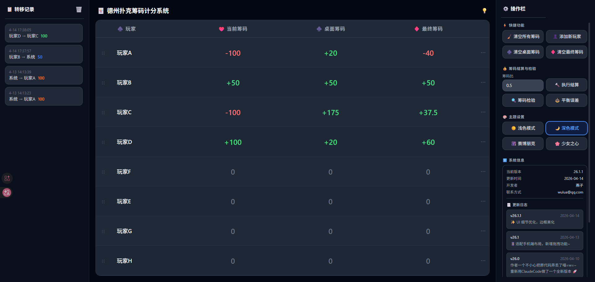

# 🃏 德州扑克筹码计分系统

一个用于线下德州扑克局的筹码计分与管理工具，支持多人筹码追踪、转移记录、结算检验和多主题切换。

🔗 **在线体验**：[dezhou.wulua.top](https://dezhou.wulua.top/)



## 功能特性

- **玩家管理** — 添加/删除玩家，双击行内编辑姓名和筹码，拖拽调整顺序
- **筹码操作** — 玩家间转移筹码、借入/归还筹码，所有操作自动记录
- **转移记录** — 完整的操作历史，支持一键撤回
- **结算系统** — 按筹码比自动计算最终结果，支持检验和平衡误差
- **四款主题** — 浅色 / 深色 / 赛博朋克 / 少女之心（带樱花飘落动画）
- **响应式布局** — PC 三栏布局，移动端底部标签页切换
- **数据持久化** — 所有数据自动保存到 localStorage

## 快速开始

```bash
# 安装依赖
pnpm install

# 启动开发服务器
pnpm dev

# 生产构建
pnpm build
```

## 技术栈

- [Vue 3](https://vuejs.org/) — Composition API + `<script setup>`
- [Vite](https://vitejs.dev/) — 构建工具
- [TailwindCSS](https://tailwindcss.com/) — 原子化 CSS

## 版本历史

| 版本 | 时间 | 说明 |
|------|------|------|
| v26.1.1 | 2026-04 | UI 细节优化、边框美化 |
| v26.1 | 2026-04 | 响应式适配、新增拖拽排序功能 |
| v26.0 | 2026-04 | 使用 Claude Code 全新重构 |
| v3.x | 2025-09 | Trae 开发，使用时长最久的版本 |
| v2.x | 2025-08 | 首个 PC-Web 版 |
| v1.x | 2025-06 | Python 上古版本 |

## 开发者

**燕子** — wulua@qq.com
